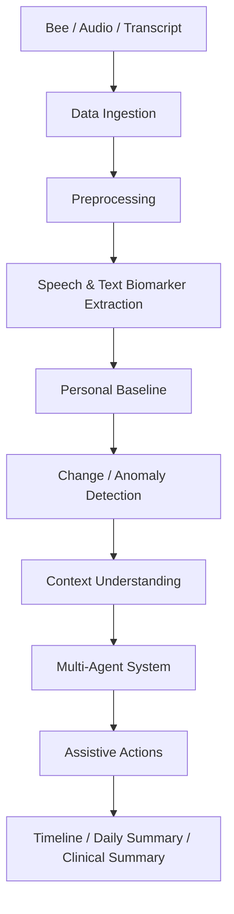

# TheraVoice

**An open-source, non-diagnostic assistive speech/communication monitoring companion.**

TheraVoice observes changes in a person's speech and language patterns over
time — relative to **their own personal baseline**, never a population norm
— and surfaces those observations to the person (and optionally a
clinician) as descriptive, non-diagnostic signals. Parkinson's disease is
the primary motivating example, but the architecture is disease-agnostic.

> ⚠️ **TheraVoice does not diagnose anything.** See
> [`docs/limitations.md`](docs/limitations.md) for the full non-diagnostic
> scope and safety constraints this project is built around.

---

## Table of contents

- [Motivation](#motivation)
- [Architecture](#architecture)
- [Installation](#installation)
- [Local development](#local-development)
- [Configuration](#configuration)
- [LLM integration](#llm-integration)
- [Run and verify](#run-and-verify)
- [API](#api)
- [Biomarker system](#biomarker-system)
- [Baseline system](#baseline-system)
- [Multi-agent architecture](#multi-agent-architecture)
- [Dashboard](#dashboard)
- [Privacy](#privacy)
- [Bee integration](#bee-integration)
- [AWS adapter](#aws-adapter)
- [Testing](#testing)
- [Known issues](#known-issues)
- [Examples](#examples)
- [Limitations](#limitations)

---

## Motivation

Clinical follow-up for neurological disorders is periodic — but day-to-day
changes in communication (slower speech, more pauses, reduced pitch
variation, increased hesitation) can happen between visits and go
unrecorded. TheraVoice provides continuous, longitudinal, **assistive**
monitoring so those changes are captured descriptively over time, without
attempting to replace clinical evaluation.

## Architecture



Every stage is a separate, independently-replaceable module under
`src/theravoice/`. The full request/response flow for
`POST /ingestion/transcript` is implemented end-to-end in
`pipeline/analysis_pipeline.py`:

```
receive transcript → validate patient → normalize → extract biomarkers
  → load/compute personal baseline → run change detection
  → run context engine → run multi-agent orchestrator
  → persist biomarkers/events/actions → return structured result
```

## Installation

Requires **Python 3.12+**.

```bash
# from the repository root
python -m venv .venv
source .venv/bin/activate        # Windows: .venv\Scripts\activate
pip install --upgrade pip
pip install -e ".[dev]"          # add ".[aws]" too if you need AWS adapters
```

(If you're on Windows with `uv`, as described in this project's original
dev notes: `uv venv`, `uv pip install -e ".[dev]"`.)

## Local development

```bash
cp .env.example .env    # optional: only needed to override secrets
theravoice serve --reload
# or: uvicorn theravoice.api.app:app --reload
```

Then open:

- Swagger UI: http://127.0.0.1:8000/docs
- Health check: http://127.0.0.1:8000/health

Seed a demo patient and run a full pipeline example:

```bash
python scripts/seed_demo_patient.py
python examples/analyze_transcript_example.py
```

Or via the CLI directly:

```bash
theravoice analyze --patient-id patient-demo-001 --text "Good morning, I am feeling okay today."
theravoice sync-bee --patient-id patient-demo-001   # pulls from bee.mode's channel
```

Or see the full real-Bee-shaped demo (works with zero Bee account needed):

```bash
python scripts/run_bee_demo.py
```

The system works **without AWS** and **without a real Bee device** by
default (`bee.mode: mock`) — but also genuinely connects to a real Bee
account via `bee.mode: sync` or `bee.mode: proxy`; see
[`docs/bee_integration.md`](docs/bee_integration.md).

## Configuration

Configuration is YAML-first, selected by `THERAVOICE_ENV`
(`development` | `testing` | `production`), under `config/`. A small,
explicit set of environment variables can override sensitive values without
touching YAML or source control — see `.env.example`:

| Env var | Overrides |
|---|---|
| `THERAVOICE_ENV` | which YAML file is loaded |
| `THERAVOICE_DATABASE_URL` | `database.url` |
| `THERAVOICE_API_KEY` | `security.api_key` (also sets `require_api_key: true`) |
| `THERAVOICE_LLM_PROVIDER` | `llm.provider` (`none`, `openai`, or `gemini`) |
| `THERAVOICE_LLM_MODEL` | `llm.model` (provider default when empty) |
| `THERAVOICE_LLM_API_KEY` | `llm.api_key` (keep this secret out of YAML and source control) |
| `THERAVOICE_LLM_TIMEOUT_SECONDS` | `llm.timeout_seconds` |
| `THERAVOICE_AWS_ENABLED` | `aws.enabled` |
| `AWS_REGION` | `aws.region` |

Key config sections: `database`, `security`, `privacy`, `baseline`,
`detection`, `hesitation` (per-language markers), `therapy`, `llm`, `aws`,
`bee`, `logging`. LLM setup and provider behavior are documented in
[`docs/llm_integration.md`](docs/llm_integration.md).

## LLM Integration

The current LLM integration adds optional natural-language generation to the
daily summary while keeping TheraVoice's structured analysis deterministic:

- A provider-neutral client supports OpenAI Chat Completions and Google
  Gemini `generateContent`, using Python's standard library rather than a new
  runtime SDK dependency.
- Provider and model selection, API key, and positive request timeout come
  from YAML settings with environment-variable overrides. The provider is
  `none` by default, so existing installations continue to use deterministic
  summaries without credentials or network access.
- Only `SummaryAgent` uses the LLM. Biomarker extraction, event detection,
  medication handling, and therapy recommendations remain functional and
  deterministic.
- A summary request requires the patient's separate
  `consent_llm_processing` flag, which defaults to `false`. It can be set at
  patient creation or changed/revoked with
  `PATCH /patients/{patient_id}/consent`.
- Only structured evidence descriptions, context notes, and suggested-action
  messages are sent for generation. Patient IDs and raw transcripts are not
  included. These fields may still contain sensitive health information.
- Provider timeouts, network/HTTP errors, missing credentials, and unknown
  providers fall back to the deterministic summary. The application's
  non-diagnostic disclaimer is retained. Generated text never determines
  events, medication actions, or therapy recommendations.
- Existing databases gain the new consent column during startup, with
  existing patients defaulted to no LLM consent.

The provider-specific configuration and data-handling guidance is in
[`docs/llm_integration.md`](docs/llm_integration.md).

## Run and Verify

The project requires Python 3.12 or newer. From the repository root, the
following PowerShell commands create the environment, install the project and
test dependencies, and run the whole test suite:

```powershell
py -3.12 -m venv .venv
.\.venv\Scripts\python.exe -m pip install --upgrade pip
.\.venv\Scripts\python.exe -m pip install -e ".[dev]"
.\.venv\Scripts\python.exe -m pytest -q
```

Start the API locally with deterministic summaries (the default):

```powershell
$env:THERAVOICE_ENV = "development"
$env:THERAVOICE_LLM_PROVIDER = "none"
.\.venv\Scripts\python.exe -m uvicorn theravoice.api.app:app --reload
```

Check that it is running at `http://127.0.0.1:8000/health`. Swagger UI is at
`http://127.0.0.1:8000/docs`. The first startup creates the configured
database tables and applies the additive patient-consent upgrade.

To test an external summary, set the provider before starting the server:

```powershell
$env:THERAVOICE_LLM_PROVIDER = "openai"
$env:THERAVOICE_LLM_MODEL = "gpt-4o-mini"
$env:THERAVOICE_LLM_API_KEY = "<provider-api-key>"
.\.venv\Scripts\python.exe -m uvicorn theravoice.api.app:app --reload
```

Use `gemini` for Google Gemini. Keep API keys in environment variables or a
secret manager; do not commit them. Create a local test patient with storage
and LLM consent, then submit a transcript:

```powershell
$patient = @{
  id = "llm-demo-001"
  display_name = "LLM Demo"
  consent_data_storage = $true
  consent_llm_processing = $true
} | ConvertTo-Json

Invoke-RestMethod -Method Post `
  -Uri "http://127.0.0.1:8000/patients" `
  -ContentType "application/json" -Body $patient

$transcript = @{
  patient_id = "llm-demo-001"
  text = "Good morning, I am feeling okay today."
} | ConvertTo-Json

Invoke-RestMethod -Method Post `
  -Uri "http://127.0.0.1:8000/ingestion/transcript" `
  -ContentType "application/json" -Body $transcript
```

The response includes the summary under `context.summary_text`. To revoke
consent, send:

```powershell
Invoke-RestMethod -Method Patch `
  -Uri "http://127.0.0.1:8000/patients/llm-demo-001/consent" `
  -ContentType "application/json" `
  -Body '{"consent_llm_processing": false}'
```

Do not use real patient data for a smoke test unless consent, provider terms,
and organizational policy explicitly permit sending summary fields to that
provider. A provider API key and network access are required for a live
provider request; automated tests mock provider responses.

## API

| Method & Path | Purpose |
|---|---|
| `GET /health` | Liveness check |
| `POST /patients` | Create a patient (consent flags default to false) |
| `GET /patients/{id}` | Fetch a patient |
| `PATCH /patients/{id}/consent` | Update/revoke LLM-processing consent |
| `POST /ingestion/transcript` | **Runs the full analysis pipeline** on a transcript |
| `POST /ingestion/audio` | Loads/validates an audio upload (see note below) |
| `GET /patients/{id}/biomarkers` | All persisted biomarker values |
| `GET /patients/{id}/biomarkers/latest` | Most recent biomarker snapshot |
| `GET /patients/{id}/events` | Detected deviation events |
| `POST/GET /patients/{id}/medications...` | Medication + schedule + adherence (never auto-changed) |
| `GET/POST /patients/{id}/therapy/...` | Exercises, recommendations, sessions |
| `GET /patients/{id}/reports/daily` | Daily summary |
| `GET /patients/{id}/reports/timeline` | Chronological event timeline |
| `GET /patients/{id}/reports/clinical` | Clinician-oriented longitudinal summary |
| `POST /patients/{id}/bee/sync` | Pull new conversations from the configured Bee channel and analyze them |

`POST /ingestion/transcript` example:

```bash
curl -X POST http://127.0.0.1:8000/ingestion/transcript \
  -H "Content-Type: application/json" \
  -d '{"patient_id": "patient-demo-001", "text": "Good morning, I am feeling okay today."}'
```

Response shape:

```json
{
  "patient_id": "patient-demo-001",
  "text_length": 39,
  "biomarkers": { "word_count": 7.0, "hesitation_count": 0.0, "...": "..." },
  "baseline_status": "insufficient_data",
  "baseline": {},
  "events": [],
  "actions": [],
  "context": { "notes": [], "summary_text": "" },
  "status": "processed"
}
```

> **Note on `POST /ingestion/audio`**: fully wired end-to-end via
> `AnalysisPipeline.run_audio()` — it validates consent, decodes the upload
> (via `librosa`), extracts acoustic biomarkers (and text biomarkers too, if
> an optional accompanying `text` form field is provided — e.g. from ASR),
> then runs the same baseline → detection → context → orchestrator →
> persistence flow as `/ingestion/transcript`. Word-count-dependent metrics
> (speech rate, articulation rate) are only computed when `text` is
> supplied; otherwise they're correctly marked `unavailable` rather than
> fabricated.

## Biomarker system

`biomarkers/extractor.py` (`BiomarkerExtractor`) is the single entry point.
It **never fabricates values** — every `BiomarkerValue` carries an
`available` flag and, when `false`, a `reason_unavailable`
(`empty_text`, `audio_unavailable`, `audio_too_short`,
`word_count_unavailable`, ...).

- **Text** (`biomarkers/text/`): hesitation (configurable EN/AR markers),
  repetition, response latency (requires real timestamps or returns
  unavailable), sentence metrics, lexical diversity.
- **Speech/acoustic** (`biomarkers/speech/`): speech rate, articulation
  rate, pauses, pitch (F0 via `librosa.pyin`), intensity (RMS dB), voice
  quality (ZCR, spectral centroid/bandwidth — explicitly descriptive, not
  clinical-grade), monotonicity (pitch coefficient of variation).

## Baseline system

`baseline/` implements a rolling personal baseline per metric
(`baseline.rolling_window_size` observations), computed only once
`baseline.minimum_observations` have been recorded. Below that threshold,
`baseline_status = "insufficient_data"` is returned explicitly rather than
comparing against a fabricated or population baseline.

## Multi-agent architecture

`agents/orchestrator.py` runs, in order: `SpeechAgent` → `TextAgent` →
`ContextAgent` → `MedicationAgent` → `TherapyAgent` → `SummaryAgent`, all
communicating via the Pydantic `AgentRequest`/`AgentResponse` schemas
(`schemas/agent.py`). Events are only created from real evidence — no agent
fabricates an event to "demonstrate" functionality.

Which agents run at all is controlled by the top-level **`agents/manifest.yaml`**
(operator-facing config, separate from the code in `src/theravoice/agents/`):
set an agent's `enabled: false` there to skip it entirely, with no code
change or redeploy — `AgentOrchestrator` reads it via `agents/manifest.py`
and fails open (every agent defaults to enabled) if the file is missing or
malformed.

## Dashboard

`dashboard/` is a small, dependency-free vanilla-JS single page app, mounted
by the API itself at **`/dashboard`** (see `api/app.py`). It shows a
patient's latest biomarkers, daily summary, recent events, and timeline, has
a **"Sync from Bee"** button (calls `POST /patients/{id}/bee/sync`), and a
box to run a transcript through the pipeline directly. No build step —
open http://127.0.0.1:8000/dashboard/ once `theravoice serve` is running.

## Privacy

`security/privacy.py` enforces `privacy.require_data_storage_consent` and
`privacy.require_audio_consent` before storing data or analyzing audio.
`privacy.store_raw_audio: false` (the default) means audio is analyzed
in-memory and never persisted to disk/DB. `security/audit.py` logs sensitive
operations (never secrets, never raw audio/transcript content).

## Bee integration

TheraVoice connects to **real** Bee data (a Bee wearable, or the Bee app on
Apple Watch/iPhone) through Bee's own documented CLI -- never an invented
API, never a stored Bee token. Two real, local channels are supported,
selected via `bee.mode` in config:

- **`sync`** -- `BeeSyncAdapter` reads a local `bee sync` markdown export
  from disk.
- **`proxy`** -- `BeeProxyAdapter` calls the local HTTP API started by
  `bee proxy` (`GET /v1/conversations`, `/v1/conversations/:id`,
  `/v1/changes`), using only the standard library (`urllib`) -- no new
  dependency.
- **`mock`** (default) -- blank, in-memory `MockBeeAdapter`, no Bee account
  needed.

See **[`docs/bee_integration.md`](docs/bee_integration.md)** for exact
commands, cited documentation links, and disclosed limitations (e.g. Bee's
documented schema doesn't expose per-utterance timestamps or raw audio, so
TheraVoice correctly reports those as `unavailable` rather than guessing).

**Try it now, no Bee account needed:**

```bash
python scripts/run_bee_demo.py
```

This runs the full pipeline against `data/examples/bee_sync_sample/` (a
small, clearly-labeled hand-authored demo export in the exact `bee sync`
format) and prints what changed and what the system suggests.

**With your own real data:**

```bash
bee login
bee sync --output bee-sync        # or: bee proxy  (see docs/bee_integration.md)
theravoice sync-bee --patient-id patient-demo-001
```

or via the API / dashboard's "Sync from Bee" button:
`POST /patients/{id}/bee/sync`.

## AWS adapter

`aws/` provides optional S3, DynamoDB, Bedrock, Lambda, and SNS adapters,
all guarded behind `aws.enabled: true` and a lazy `boto3` import — the
system runs fully without AWS or the `aws` extra installed.

> Note: `aws/lambda.py` is named to match the target project structure;
> since `lambda` is a reserved Python keyword, import it via
> `importlib.import_module("theravoice.aws.lambda")` rather than a normal
> `import` statement.

## Testing

```bash
python -m pytest -q
```

Test modules cover schemas, normalization, text/speech biomarkers, the
`BiomarkerExtractor`'s graceful-degradation behavior, baseline
(`insufficient_data` and update behavior), z-score change detection,
context/medication rules (including "never claims causation"), agents and
the orchestrator (including "medication agent never emits a medication
change"), repositories, the full FastAPI surface, and the end-to-end
`AnalysisPipeline`. The LLM tests cover provider request formatting,
configuration, timeout handling, consent enforcement, deterministic
fallback, and the existing-database consent-column upgrade.

Expected output: all tests pass (`pytest` exits 0). Tests run against an
isolated temp-file SQLite database per session (see `tests/conftest.py`) and
use `THERAVOICE_ENV=testing`, which lowers `baseline.minimum_observations`
to 3 for faster baseline-building test scenarios.

## Examples

- `examples/analyze_transcript_example.py` — run the pipeline directly, no
  HTTP layer.
- `scripts/seed_demo_patient.py` — seed `patient-demo-001`.
- `data/schemas/sample_patient.json` — an example `Patient` payload.
- `data/examples/sample_transcripts/sample_01.txt` — the canonical example
  transcript from the spec ("Good morning, I am feeling okay today.").

## Limitations

See [`docs/limitations.md`](docs/limitations.md) — this project is
deliberately, permanently non-diagnostic and non-prescriptive.

## License

MIT — see [`LICENSE`](LICENSE).
